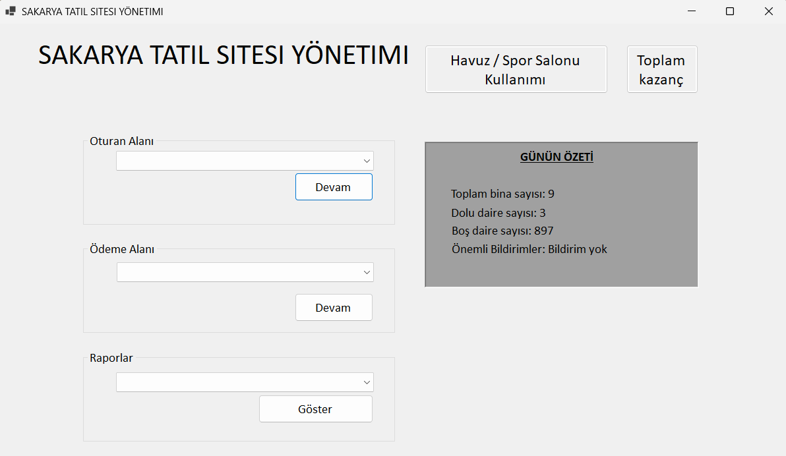
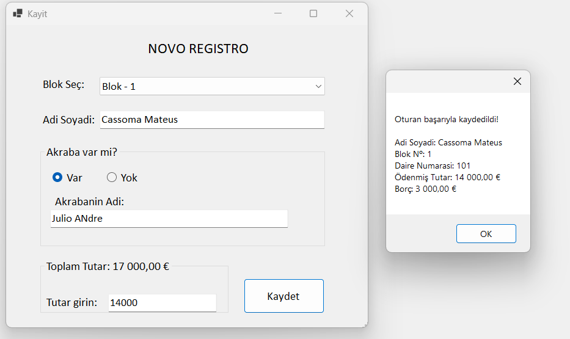
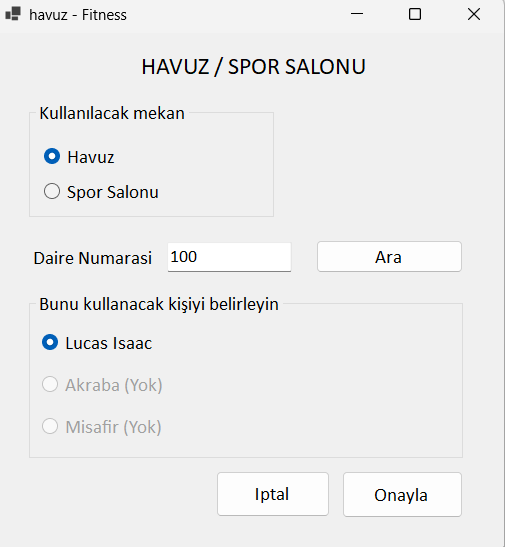
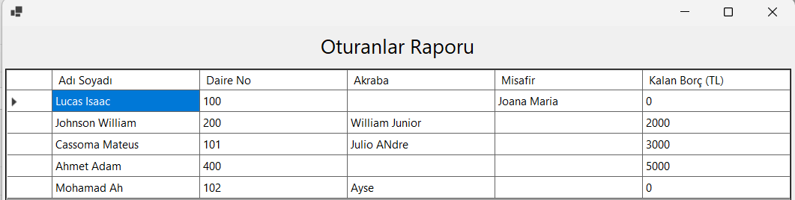
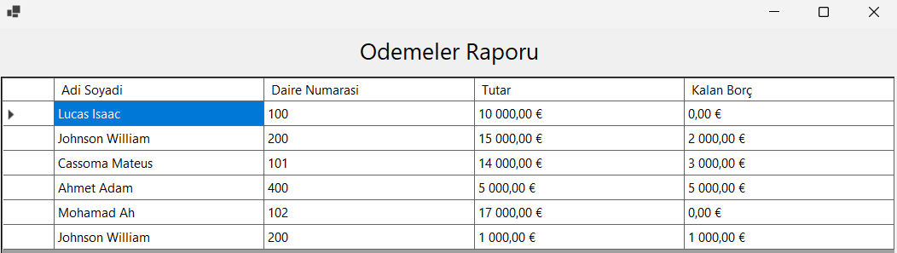

# 🏢 Condominium Management System - Desktop App

Academic project developed during my first year of the **Computer Engineering degree at Sakarya Üniversitesi**.

This project was for the **Object-Oriented Programming using C#, Windows Forms, and Object-Oriented Programming principles**.

The application is a desktop-based condominium management system that manages buildings, apartments, residents, payments, and access control for shared facilities such as swimming pools and fitness centers.

---

## 🛠 Technologies

- C#
- .NET Framework
- Windows Forms

---

## ✨ Features

- Building management
- Apartment management
- Resident management
- Payment management
- Swimming pool access control
- Fitness center access control
- Data and payment reports
- CRUD operations (Create, Read, Update, Delete)
- File-based data persistence

---

## 📸 Screenshots

### Main Interface

---

### Register New User

---

### Use of the pool

---

### Reports

---

---

## 📄 Documentation

The `docs` folder contains the original Project Specification

---

## ▶️ How to Run

1. Open the solution (`.sln`) using **Visual Studio**.
2. Restore NuGet packages if necessary.
3. Build the solution (`Ctrl + Shift + B`).
4. Run the application (`Ctrl + F5`).

The application uses the following text files for data persistence:

- `Data.txt`
- `Mekan.txt`
- `Odeme.txt`
- `Fitness.txt`
- `HavuzKul.txt`

Make sure these files remain in the application's working directory.

---

## 📌 Notes

This repository preserves the original academic project as it was developed for the **Object-Oriented Programming** course.

This project is a Windows Forms implementation of the same management domain previously developed as a C++ console application.

For the original C++ version, visit:

https://github.com/Lucaskatalahali/condominium-management-system

For more academic projects, visit my **Computer Engineering Projects** repository:

https://github.com/Lucaskatalahali/computer-engineering-projects
